# Customer Churn Prediction & Retention Intelligence Engine

```mermaid
flowchart LR
  U[User/Admin] --> IN[Customer Input\nBehavioral + Transactional]
  IN --> IMG[Product Image Upload]
  IMG --> IQ[Image Quality Analysis\nBlur/Resolution/Contrast/Sharpness]
  IQ --> FF[Feature Fusion\nCustomer + Image Score]
  FF --> ML[ML Prediction\nLR / RF / XGBoost / NN]
  ML --> P[Churn Probability 0-100%]
  P --> SH[SHAP Analysis]
  SH --> CA[Cause -> Action Engine]
  CA --> R[Retention Recommendation]
```

 



## Quick Start (Docker — recommended)
```bash
docker compose up --build -d
docker compose ps   # wait until api + dashboard show "(healthy)"
```
First boot trains everything inside the container automatically (synthetic data +
model training, ~6 min); restarts skip straight to serving. Services:

| Service | URL |
|---|---|
| API (OpenAPI docs at `/docs`) | http://localhost:8000 |
| Dashboard | http://localhost:8501 |
| MLflow | http://localhost:5000 |

```bash
curl http://localhost:8000/health
# {"status":"ok","version":"1.0.0","model_loaded":true}
```

## Data schema (`configs/config.yaml:data_schema`)
Target column is `churned` (0/1). Behavioral: `login_frequency_last_30d`,
`avg_session_duration_min`, `feature_usage_score` (0–100), `support_tickets_last_90d`.
Transactional: `total_purchases`, `avg_invoice_amount`, `late_payments_count`,
`payment_method` + `subscription_tier` (categorical), `customer_lifetime_value`.
`avg_days_since_last_login` is also generated and powers the dormant-account rule.
Both YAML configs are the single source of truth — schemas, fusion extras, SHAP
cause mapping, and API fields are all derived from them at runtime (no hardcoded columns).

## API reference (verified against the running stack)
- `GET /health` — liveness + model-loaded flag
- `POST /predict-churn` — churn probability
```bash
curl -X POST localhost:8000/predict-churn -H "Content-Type: application/json" -d "{
  \"customer_id\": \"CUST-00006\", \"login_frequency_last_30d\": 4.38,
  \"avg_session_duration_min\": 7.45, \"feature_usage_score\": 56.66,
  \"support_tickets_last_90d\": 1, \"total_purchases\": 3, \"avg_invoice_amount\": 180.0,
  \"late_payments_count\": 1, \"avg_days_since_last_login\": 13.57,
  \"customer_lifetime_value\": 330.0, \"payment_method\": \"credit_card\",
  \"subscription_tier\": \"basic\", \"image_quality_score\": 0.704}"
# {"customer_id":"CUST-00006","churn_probability":38.49,"risk_band":"low"}
```
- `GET /explain/{customer_id}` — SHAP top features + narrative
```bash
curl localhost:8000/explain/CUST-00006
# {"customer_id":"CUST-00006","churn_probability":38.49,"base_value":0.3432,
#  "top_features":[...],"explanation":"Customer CUST-00006 has a 38.5% churn risk. ..."}
```
- `GET /recommend/{customer_id}` — ranked retention actions (max 3 per customer) +
  priority score (`churn_probability * customer_lifetime_value`)
```bash
curl localhost:8000/recommend/CUST-00006
# {"customer_id":"CUST-00006","churn_probability":38.49,"top_causes":["late_payments"],
#  "recommended_actions":[{"cause":"late_payments","action":"Offer flexible payment plan",
#  "shap_corroborated":true}, ...],"confidence_score":0.55,"priority_score":12692.85}
```
- `POST /upload-image?customer_id=X&product_id=Y` — multipart image upload + quality report
- `POST /predict-with-image` — same body as `/predict-churn` plus optional `image_b64`
  (base64, data-URI ok); fuses analyzed image quality into the prediction

## Training guide
- Config: `configs/config.yaml` (schema, paths, thresholds, weights, hyperparams)
- Rules: `configs/cause_action_rules.yaml` (extend without code changes)
- Run `python -m src.models.training`: stratified train/val/test split (15%/15%),
  Optuna tuning (30 trials), 5-fold CV on the primary metric (`roc_auc`).
  Best model → `models/best_model.joblib`, fusion pipeline →
  `models/fusion_pipeline.joblib`, standalone scaler/encoder →
  `models/artifacts/scaler.joblib` + `encoder.joblib`, comparison report →
  `models/model_comparison.json`, processed splits → `data/processed/`.
  MLflow tracks to the configured URI (`http://localhost:5000` when a server runs,
  otherwise training continues with tracking disabled).
  The neural net (`hidden_layers [64, 32, 16]`, dropout 0.3, early stopping patience 5)
  uses PyTorch when installed, otherwise sklearn's MLPClassifier with manual
  patience-based early stopping (see `src/models/torch_nn.py`).

## Tests & coverage
```bash
pytest --cov=src --cov-report=term-missing
```
Current: **38 passed, 82% total coverage** (core library modules 82–100%;
torch-only branches excluded — torch is an optional dependency).
CI (`.github/workflows/ci.yml`) runs `black --check`, `isort --check-only`, `flake8`,
`mypy src`, and the full pytest suite — all green.

## Getting Started (git clone → working prediction)
```bash
git clone <repo-url> && cd churn-intelligence-engine
docker compose up --build -d
docker compose ps  # wait for api + dashboard "(healthy)"; first boot self-trains (~6 min)
curl http://localhost:8000/health
# {"status":"ok","version":"1.0.0","model_loaded":true}
curl -X POST localhost:8000/predict-churn -H "Content-Type: application/json" -d "{
  \"customer_id\": \"CUST-00006\", \"login_frequency_last_30d\": 4.38,
  \"avg_session_duration_min\": 7.45, \"feature_usage_score\": 56.66,
  \"support_tickets_last_90d\": 1, \"total_purchases\": 3, \"avg_invoice_amount\": 180.0,
  \"late_payments_count\": 1, \"avg_days_since_last_login\": 13.57,
  \"customer_lifetime_value\": 330.0, \"payment_method\": \"credit_card\",
  \"subscription_tier\": \"basic\", \"image_quality_score\": 0.704}"
# {"customer_id":"CUST-00006","churn_probability":38.49,"risk_band":"low"}
```
No virtualenv, no manual training, no `.env` files — the compose stack bootstraps
itself. Local development alternative: `pip install -r requirements.txt`,
`python -m src.data_ingestion.generate_synthetic`, `python -m src.models.training`,
`uvicorn src.api.app:app --port 8000`, `streamlit run src/dashboard/app.py`.
